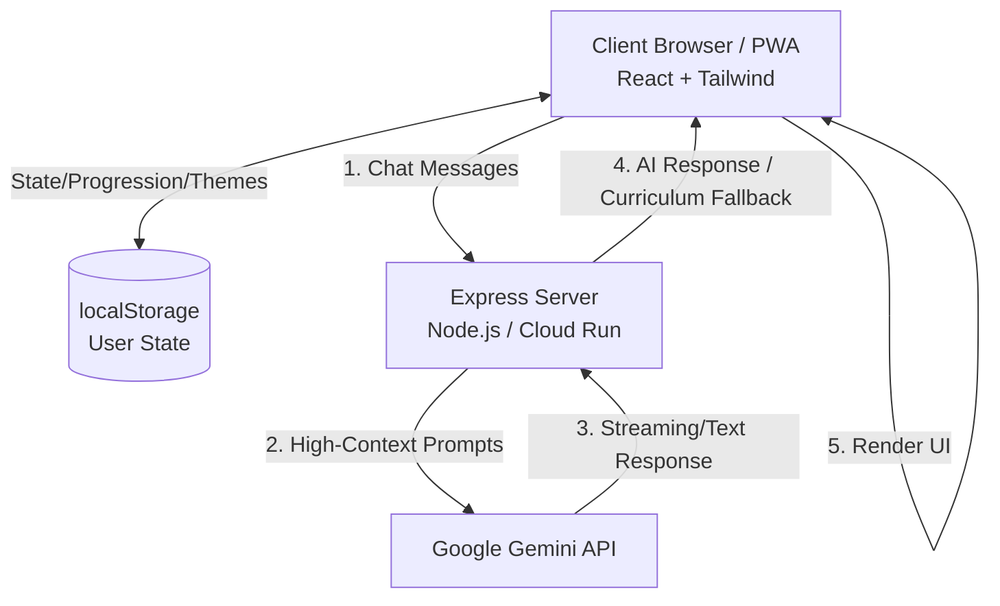

# Architecture

## Overview
The application is a single-page React application (SPA) with a custom Express backend for API proxying and SSR pre-rendering (for SEO).

## Diagram

## Layering Rules
- **UI Components:** (`src/components/`, `src/features/**/components/`) Do not contain business logic. Receive data via props and call action handlers.
- **State/Hooks:** (`src/features/**/hooks/`) Manages local state and React context.
- **Server API:** (`src/server.ts`, `src/server/api/`) Handlers for proxying external APIs securely. No business logic on the client for external secrets.
- **Data Access:** Data persistence is intentionally scoped to `localStorage` (Offline-first approach). No cloud database is used.